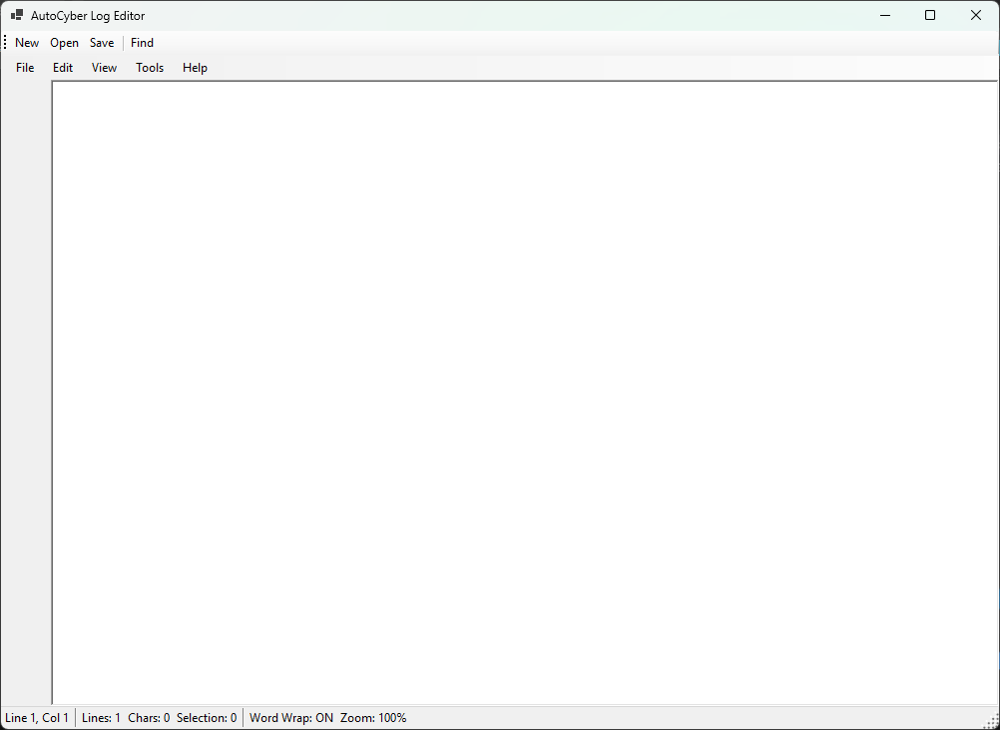
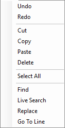
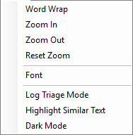
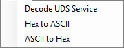

# AutoCyber Log Editor

A WinForms-based log editor designed for **automotive cybersecurity log triage**, supporting:
- UDS diagnostics
- CAN log inspection
- Hex / ASCII decoding
- Line marking and triage workflows

Built for MS539 – Programming Concepts.

---

## Features

- Open / Save text-based log files
- Find, Replace, Live Search
- Word Wrap, Zoom, Font controls
- Log Triage Mode (mark / clear lines)
- Highlight Similar Text
- Decode UDS Service IDs
- Hex ⇄ ASCII conversion
- Context menu utilities for rapid analysis

---

## Screenshots

### Main Editor Interface

### Edit Menu

### View & Log Triage Tools

### Decode & Conversion Tools

### Context Menu (Right-Click)

---

## Tech Stack

- C#
- .NET 10
- Windows Forms
- RichTextBox extensions
- Custom context menus

---

## Status

✅ Feature-complete  
✅ Builds clean  
✅ Demo-ready  
✅ Meets course objectives
